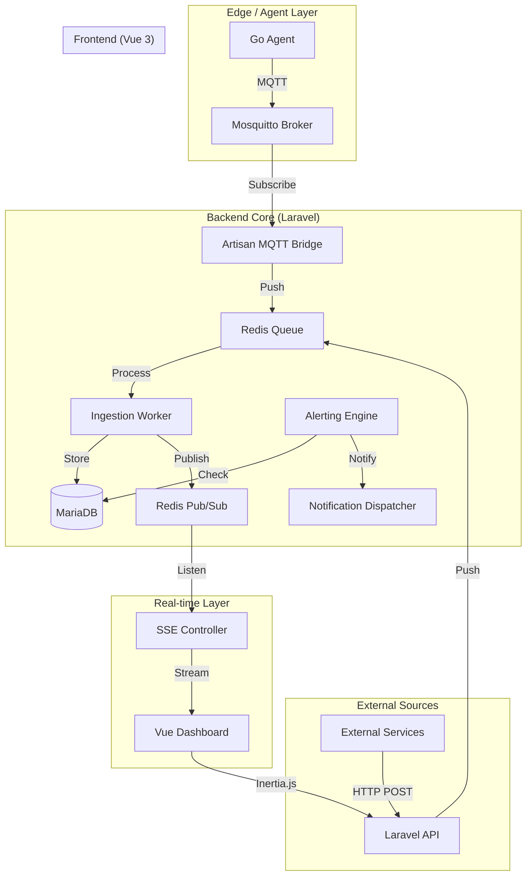

# Observability Micro-Dashboard PoC

A high-performance, multi-tenant monitoring platform designed to ingest, process, and visualize metrics from diverse sources (HTTP and MQTT) in real-time.

---

## 🚀 Overview

The **Observability Micro-Dashboard PoC** provides a unified full-stack solution for modern microservice and IoT environments. It combines a lightweight **Go-based system agent** with a **Laravel-powered core** and a reactive **Vue 3 dashboard** to deliver sub-second monitoring and stateful alerting.

### Core Objectives
*   **Low-Latency Ingestion:** Asynchronous processing via Redis queues ensuring < 500ms availability.
*   **Real-Time Visualization:** Native SSE (Server-Sent Events) bridge for "live" dashboard updates.
*   **Multi-Tenant by Design:** Strict isolation for different clients or environments at the database and API levels.
*   **Hybrid Ingestion:** Native support for both RESTful HTTP and MQTT (IoT/Edge) sources.

---

## ✨ Key Features

*   **Multi-tenant Ingestion:** API token-based authentication with high-speed single/bulk HTTP endpoints.
*   **MQTT Bridge:** Integrated subscriber for ingesting metrics from edge devices via Mosquitto.
*   **Live Metrics Streaming:** SSE-powered charts that update in real-time without browser polling.
*   **Automated Downsampling:** Scheduled rollups (1m/5m) for efficient long-term historical analysis.
*   **Stateful Alerting:** Rule engine with state transitions (OK ↔ FIRING) and notification dispatchers (Webhooks, Email, etc.).
*   **Edge Go Agent:** A footprint-optimized binary for collecting CPU, Memory, Disk, and Network metrics.

---

## 🛠 Tech Stack

| Layer | Technology |
| :--- | :--- |
| **Backend** | Laravel 11 (PHP 8.2), Inertia.js |
| **Frontend** | Vue 3, Pinia, Tailwind CSS, Vite |
| **Edge Agent** | Go 1.2x |
| **Persistence** | MariaDB 10.11 (Metrics & Metadata) |
| **Cache/PubSub** | Redis 7 |
| **MQTT Broker** | Mosquitto 2.0 |
| **Testing** | Playwright (BDD), PHPUnit, Vitest |

---

## 🏗 Architecture

The system follows a **Hybrid Monolith + Edge Agent** architectural style.



### Key Architectural Patterns
*   **Event-Driven Ingestion:** All metrics are buffered via Redis to ensure high availability and fast API responses (`202 Accepted`).
*   **Clean Architecture:** Clear separation between Domain logic, Use Cases, and Infrastructure.
*   **SSE Bridge:** Efficient one-way streaming from Redis Pub/Sub to the browser.

---

## 📁 Repository Structure

```plaintext
.
├── app/                # Laravel 11 Backend + Vue 3 (Inertia)
│   ├── app/            # Domain Logic & Controllers
│   ├── resources/js/   # Vue 3 UI (Charts, Store, Pages)
│   └── database/       # Migrations & Rollup Logic
├── agent/              # Go-based System Agent
├── docs/               # Detailed PRDs, Architecture, and Stories
├── docker/             # Configs for Mosquitto, Redis, etc.
└── docker-compose.yml  # Local Development Environment
```

---

## 🎥 Demo

See the system in action (E2E Test Recording). This demonstrates the full flow: Login -> Dashboard -> Latency Check -> Real-time Updates (SSE).

[](docs/assets/demo-video.webm)

*Click the image to view the video recording of the automated smoke test.*

---

## 🚥 Getting Started

### Prerequisites
*   Docker & Docker Compose

### Fast Track (Development)
1.  **Clone the repository**
2.  **Environment Setup:**
    ```bash
    cp .env.example .env
    ```
3.  **Boot the environment:**
    ```bash
    docker compose up -d
    ```
4.  **Install dependencies:**
    ```bash
    docker compose exec app composer install
    docker compose exec app npm install
    ```
5.  **Run Migrations:**
    ```bash
    docker compose exec app php artisan migrate --seed
    ```
6.  **Access the dashboard:** Open `http://localhost:8080` (default credentials in seeds).

---

## 🧪 Testing

The project uses a pyramid testing strategy:

*   **E2E (Playwright BDD):** Validates the "Ingest → Process → Visualize" flow.
    ```bash
    npm run test:e2e
    ```
*   **Backend (PHPUnit):** Covers ingestion logic, job processing, and alerting.
    ```bash
    php artisan test
    ```
*   **Frontend (Vitest):** Tests metrics stores and chart rendering.
    ```bash
    npm run test:unit
    ```

---

## 📝 License
Built as a PoC for high-performance observability.
