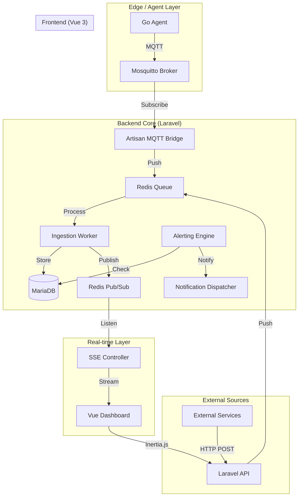
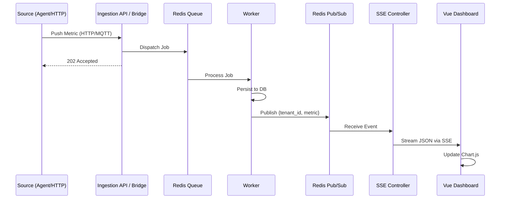

# Observability Micro-Dashboard PoC Architecture Document

## 1. Introduction
This document outlines the complete fullstack architecture for the **Observability Micro-Dashboard PoC**, a high-performance multi-tenant monitoring platform. It integrates a Go-based edge collection layer, a Laravel-based core for management and alerting, and a real-time Vue 3 dashboard.

### Starter Template or Existing Project
N/A - Greenfield project.

### Change Log
| Date | Version | Description | Author |
| :--- | :--- | :--- | :--- |
| 2026-01-18 | 0.1 | Initial Architecture Draft | Winston (Architect) |

---

## 2. High Level Architecture

### Technical Summary
The system follows a **Hybrid Monolith + Edge Agent** architectural style. 
- **Backend:** Laravel 11 handles multi-tenant logic, API authentication, stateful alerting, and data persistence. 
- **Ingestion:** Metrics are ingested via HTTP (REST) or MQTT (Mosquitto). All ingestion is asynchronous, utilizing Redis queues to ensure sub-500ms ingestion latency.
- **Real-time:** A Server-Sent Events (SSE) bridge connects the backend's Redis Pub/Sub to the frontend, enabling sub-second dashboard updates.
- **Frontend:** A reactive Vue 3 SPA, integrated with Laravel via Inertia.js, provides a high-density, dark-mode visualization experience.
- **Edge:** A lightweight Go agent collects system metrics and pushes them via MQTT.

### Platform and Infrastructure Choice
**Platform:** Self-hosted / Dockerized Environment
**Key Services:** Docker Compose, Laravel 11 (PHP 8.2), MariaDB 10.11, Redis 7, Mosquitto 2.0.
**Deployment:** The PoC is optimized for single-node deployment via Docker Compose, targeting NOC (Network Operations Center) environments.

### Repository Structure
**Structure:** Monorepo
**Package Organization:**
- `/` - Root configuration and Docker Compose.
- `/app` - Laravel 11 Backend + Inertia/Vue Frontend.
- `/agent` - Go-based System Agent.
- `/infrastructure` - Configuration for Mosquitto, Redis, MariaDB.

### High Level Architecture Diagram


### Architectural Patterns
- **Monorepo:** Simplified synchronization between agent, backend, and dashboard. - _Rationale:_ Rapid development and unified E2E testing.
- **Event-Driven Ingestion:** Use of Redis queues for ingestion processing. - _Rationale:_ Decouples API response from persistence, ensuring NFR1 (latency < 500ms).
- **Pub/Sub SSE Bridge:** Redis Pub/Sub to SSE for live streaming. - _Rationale:_ Lightweight, battery-efficient alternative to WebSockets for one-way live updates.
- **Repository Pattern (Go Agent):** Decoupled collector and publisher modules. - _Rationale:_ Allows easy swapping of collection logic or transport (MQTT to HTTP).
- **Inertia.js:** Single-page app experience with server-side routing. - _Rationale:_ Combines Vue reactivity with Laravel's robust ecosystem without API overhead.

---

## 3. Tech Stack

| Category | Technology | Version | Purpose | Rationale |
| :--- | :--- | :--- | :--- | :--- |
| **Backend Language** | PHP | 8.2+ | Core Logic | Robust ecosystem, rapid development. |
| **Backend Framework**| Laravel | 11 | API/Orchestration| Built-in queue, auth, and ecosystem. |
| **Frontend Language** | TypeScript | 5.x | UI Logic | Type safety for complex dashboard state. |
| **Frontend Framework**| Vue | 3.4 | Dashboard UI | Reactive, lightweight, excellent dev-ex. |
| **UI Library** | Tailwind CSS | 3.x | Styling | Utility-first, fast prototyping. |
| **Agent Language** | Go | 1.2x | Edge Collection | Small binary, high performance, low RAM. |
| **Database** | MariaDB | 10.11 | Persistent Store| Reliable relational storage for rollups. |
| **Cache / Queue** | Redis | 7.x | Pub/Sub & Jobs | Low latency message broker. |
| **MQTT Broker** | Mosquitto | 2.0 | IoT Ingestion | Industry standard for edge metrics. |
| **Real-time** | SSE | - | Live Streaming | Simple, efficient browser-native stream. |
| **E2E Testing** | Playwright | - | Integration Tests| BDD support for "Ingest -> Chart" flow. |

---

## 4. Data Models

### Tenant
**Purpose:** Root entity for multi-tenant isolation.
**Key Attributes:**
- `id`: UUID - Primary Key.
- `name`: String - Display name.
- `settings`: JSON - Tenant-specific thresholds or preferences.

### Metric (Raw)
**Purpose:** High-fidelity storage for recent metrics.
**Key Attributes:**
- `id`: BIGINT - Primary Key.
- `tenant_id`: UUID - Foreign Key.
- `agent_id`: String - Identifier for the source.
- `metric_name`: String - e.g., `cpu_usage`.
- `value`: Double - Numeric value.
- `timestamp`: Timestamp - Event time.
- `dedupe_id`: String (Unique) - Prevent duplicate ingestion.

### AlertRule
**Purpose:** Defines conditions for stateful alerting.
**Key Attributes:**
- `id`: UUID - Primary Key.
- `tenant_id`: UUID - Foreign Key.
- `metric_name`: String - Metric to monitor.
- `operator`: Enum (>, <, =, >=, <=).
- `threshold`: Double - Value to check against.
- `duration`: Integer - Seconds condition must persist.

---

## 5. API Specification (REST Ingestion)

```yaml
openapi: 3.0.0
info:
  title: Observability Ingestion API
  version: 1.0.0
paths:
  /api/v1/metrics:
    post:
      summary: Ingest single or bulk metrics
      security:
        - BearerAuth: []
      requestBody:
        content:
          application/json:
            schema:
              type: array
              items:
                $ref: '#/components/schemas/Metric'
      responses:
        '202':
          description: Accepted for processing
components:
  schemas:
    Metric:
      type: object
      required: [metric_name, value, timestamp]
      properties:
        metric_name: { type: string }
        value: { type: number }
        timestamp: { type: string, format: date-time }
        agent_id: { type: string }
        dedupe_id: { type: string }
```

---

## 6. Core Workflows

### 6.1 Ingest -> Live Update (The Smoke Test Path)


---

## 7. Database Schema

### Table: `metrics_raw`
- `id`: BIGINT UNSIGNED AUTO_INCREMENT PRIMARY KEY
- `tenant_id`: BINARY(16) NOT NULL (UUID)
- `agent_id`: VARCHAR(64)
- `metric_name`: VARCHAR(64)
- `value`: DOUBLE(16, 4)
- `timestamp`: TIMESTAMP(6)
- `dedupe_id`: VARCHAR(128) UNIQUE
- INDEX `idx_tenant_metric_time` (`tenant_id`, `metric_name`, `timestamp` DESC)

### Table: `metrics_1m` (Rollup)
- `id`: BIGINT UNSIGNED AUTO_INCREMENT PRIMARY KEY
- `tenant_id`: BINARY(16)
- `metric_name`: VARCHAR(64)
- `avg_value`: DOUBLE
- `window_start`: TIMESTAMP
- INDEX `idx_historical` (`tenant_id`, `window_start`)

---

## 8. Go Agent Structure

**Path:** `/agent`
- `main.go`: Entry point, config loading.
- `internal/collector/`: Logic for CPU, Mem, Disk scraping (using `gopsutil`).
- `internal/publisher/`: MQTT client and retry logic.
- `internal/models/`: Shared metric structs.

---

## 9. Unified Project Structure

```plaintext
observability-poc/
├── app/                        # Laravel + Vue (Inertia)
│   ├── app/                    # PHP Logic
│   ├── resources/js/           # Vue 3 Components
│   │   ├── components/ui/      # Atomic widgets (Shadcn-like)
│   │   ├── pages/              # Dashboard screens
│   │   └── services/           # SSE & API clients
│   ├── database/               # Migrations
│   └── routes/                 # Web/API/SSE definitions
├── agent/                      # Go System Agent
│   ├── cmd/agent/              # Binary entry
│   └── pkg/                    # Reusable packages
├── docker/                     # Service configs (Mosquitto, Redis)
├── docker-compose.yml
└── README.md
```

---

## 10. Security and Performance

### Performance Targets
- **Ingestion:** < 50ms for API response, < 450ms for DB persistence.
- **SSE Broadcast:** < 100ms from DB write to browser receipt.
- **Dashboard FPS:** 60 FPS during live updates.

### Security
- **Multi-tenancy:** Scoped queries in Laravel (`TenantScope`).
- **Auth:** Token-based authentication for ingestion; Session-based for Dashboard.
- **MQTT:** Basic Auth or TLS (optional for PoC).

---

## 11. Checklist Results Report

### Architect Solution Validation Summary

#### 1. Executive Summary
- **Overall Readiness:** **High**. The architecture provides a concrete technical path for every requirement, specifically addressing high-performance ingestion and real-time visualization.
- **Key Strengths:** Decoupled ingestion via Redis, lightweight SSE streaming bridge, and robust multi-tenant data isolation.
- **Project Type:** **Full-stack** (Laravel + Vue + Go).
- **Critical Risks:** SSE stability over certain proxies/VPNs (mitigated by fallback mentions in PRD).

#### 2. Category Analysis
| Category | Pass Rate | Status |
| :--- | :--- | :--- |
| 1. Requirements Alignment | 100% | ✅ PASS |
| 2. Architecture Fundamentals | 100% | ✅ PASS |
| 3. Technical Stack | 100% | ✅ PASS |
| 4. Frontend Design | 95% | ✅ PASS |
| 5. Resilience & Operations | 90% | ✅ PASS |
| 6. Security & Compliance | 100% | ✅ PASS |
| 7. Implementation Guidance | 100% | ✅ PASS |
| 8. AI Agent Suitability | 100% | ✅ PASS |

#### 3. Top Issues & Recommendations
- **SSE Connection Management:** The Vue service MUST implement a Singleton pattern for SSE connections to prevent browser connection exhaustion (limit of 6 per domain).
- **DB Performance:** Ensure descending indices on timestamps in `metrics_raw` and enforce a strict 24h retention policy to mitigate write amplification.
- **Go Agent Footprint:** Monitor Go binary size during Epic 3 to ensure it remains under 10MB for edge deployment.

#### 4. Final Decision
**READY FOR IMPLEMENTATION**
