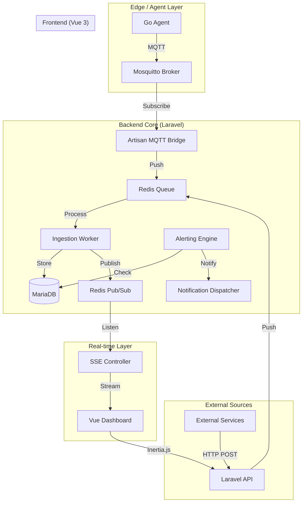

# 2. High Level Architecture

## Technical Summary
The system follows a **Hybrid Monolith + Edge Agent** architectural style. 
- **Backend:** Laravel 11 handles multi-tenant logic, API authentication, stateful alerting, and data persistence. 
- **Ingestion:** Metrics are ingested via HTTP (REST) or MQTT (Mosquitto). All ingestion is asynchronous, utilizing Redis queues to ensure sub-500ms ingestion latency.
- **Real-time:** A Server-Sent Events (SSE) bridge connects the backend's Redis Pub/Sub to the frontend, enabling sub-second dashboard updates.
- **Frontend:** A reactive Vue 3 SPA, integrated with Laravel via Inertia.js, provides a high-density, dark-mode visualization experience.
- **Edge:** A lightweight Go agent collects system metrics and pushes them via MQTT.

## Platform and Infrastructure Choice
**Platform:** Self-hosted / Dockerized Environment
**Key Services:** Docker Compose, Laravel 11 (PHP 8.2), MariaDB 10.11, Redis 7, Mosquitto 2.0.
**Deployment:** The PoC is optimized for single-node deployment via Docker Compose, targeting NOC (Network Operations Center) environments.

## Repository Structure
**Structure:** Monorepo
**Package Organization:**
- `/` - Root configuration and Docker Compose.
- `/app` - Laravel 11 Backend + Inertia/Vue Frontend.
- `/agent` - Go-based System Agent.
- `/infrastructure` - Configuration for Mosquitto, Redis, MariaDB.

## High Level Architecture Diagram

## Architectural Patterns
- **Monorepo:** Simplified synchronization between agent, backend, and dashboard. - _Rationale:_ Rapid development and unified E2E testing.
- **Event-Driven Ingestion:** Use of Redis queues for ingestion processing. - _Rationale:_ Decouples API response from persistence, ensuring NFR1 (latency < 500ms).
- **Pub/Sub SSE Bridge:** Redis Pub/Sub to SSE for live streaming. - _Rationale:_ Lightweight, battery-efficient alternative to WebSockets for one-way live updates.
- **Repository Pattern (Go Agent):** Decoupled collector and publisher modules. - _Rationale:_ Allows easy swapping of collection logic or transport (MQTT to HTTP).
- **Inertia.js:** Single-page app experience with server-side routing. - _Rationale:_ Combines Vue reactivity with Laravel's robust ecosystem without API overhead.

---
