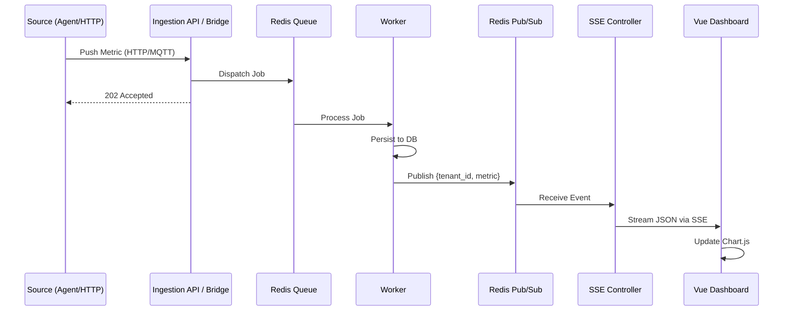

# 6. Core Workflows

## 6.1 Ingest -> Live Update (The Smoke Test Path)

```mermaid
sequenceDiagram
    participant S as Source (Agent/HTTP)
    participant A as Ingestion API / Bridge
    participant Q as Redis Queue
    participant W as Worker
    participant P as Redis Pub/Sub
    participant SC as SSE Controller
    participant D as Vue Dashboard

    S->>A: Push Metric (HTTP/MQTT)
    A->>Q: Dispatch Job
    A-->>S: 202 Accepted
    Q->>W: Process Job
    W->>W: Persist to DB
    W->>P: Publish {tenant_id, metric}
    P->>SC: Receive Event
    SC->>D: Stream JSON via SSE
    D->>D: Update Chart.js
```

---
