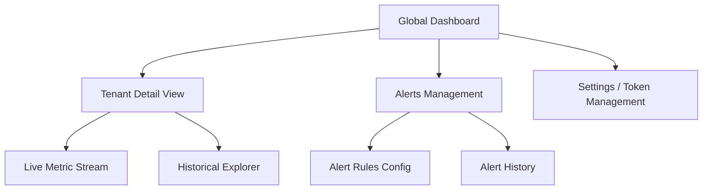
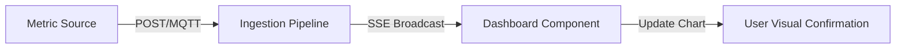

# Observability Micro-Dashboard PoC UI/UX Specification

## 1. Introduction
This document defines the user experience goals, information architecture, user flows, and visual design specifications for the **Observability Micro-Dashboard PoC**'s user interface. It serves as the foundation for visual design and frontend development, ensuring a cohesive and user-centered experience.

## 2. Overall UX Goals & Principles

### Target User Personas
*   **DevOps/System Operator (Primary):** Technical professionals managing small clusters/IoT fleets. They need instant visibility into system health and sub-second updates to minimize MTTD.
*   **Application Developer (Secondary):** Users pushing custom metrics via HTTP who need simple widget configurations and clear ingestion status.

### Usability Goals
1.  **Immediacy:** Sub-second feedback on ingestion and dashboard updates.
2.  **Information Density:** Maximizing data visibility on 1080p+ NOC screens without overwhelming the user.
3.  **Low Friction:** Fast transition between "Live" and "Historical" modes.

### Design Principles
1.  **"Live" by Default:** The UI should prioritize real-time streaming data over static snapshots.
2.  **Contextual Clarity:** Always clearly indicate if the data is "Live" or "Historical" and which tenant/agent it belongs to.
3.  **Technical Aesthetic (NOC-First):** Focus on high-contrast, dark-mode visualization optimized for continuous monitoring.

## 3. Change Log
| Date | Version | Description | Author |
| :--- | :--- | :--- | :--- |
| 2026-01-18 | 0.1 | Initial Draft | UX Agent |

## 3. Information Architecture (IA)

### Site Map / Screen Inventory


### Navigation Structure
*   **Primary Navigation (Sidebar):** Global Dashboard (Home), Alerts, Settings/Tokens.
*   **Secondary Navigation (Contextual):** Within Tenant Detail: Toggle between "Live" and "Historical", Filter by Agent ID.
*   **Breadcrumb Strategy:** `Home > [Tenant Name] > [Agent ID (Optional)]`.

## 4. User Flows

### Flow: Ingest -> Live Update (The Smoke Test Path)
*   **User Goal:** Verify system health by seeing a pushed metric appear instantly.
*   **Entry Points:** Any external source (HTTP/MQTT) pushing data.
*   **Success Criteria:** Dashboard chart updates within 500ms of ingestion.
*   **Flow Diagram:**

*   **Edge Cases:** Connection drop (Reconnect logic), High frequency (Throttling updates).

### Flow: Creating an Alert Rule
*   **User Goal:** Configure a threshold-based alert for a critical metric.
*   **Entry Points:** Alerts Management -> "Create Rule".
*   **Success Criteria:** Rule saved and appears in "Active Rules" list.
*   **Flow Diagram:**
```mermaid
graph TD
    A[Alerts View] -->|Click Create| B[Rule Form]
    B -->|Select Metric| C[Define Threshold]
    C -->|Select Channel| D[Save Rule]


## 5. Wireframes & Mockups

### Primary Design Files
**Note:** Low-fidelity mockups are defined below to guide layout and hierarchy. High-fidelity prototypes (Figma/Lovable) will follow.

### Key Screen Layouts: Global Dashboard
*   **Purpose:** High-level overview of system status across all tenants/agents.
*   **Key Elements:**
    *   **Agent Status Cards:** Small cards showing Agent Name, ID, and pulsing Live/Offline indicator.
    *   **Global Alert Summary:** Counter showing current FIRING alerts.
    *   **Activity Sparklines:** Tiny, low-res charts showing ingestion activity for the last 5 minutes.
*   **Interaction Notes:** Clicking an Agent Card navigates to the Tenant Detail View with that agent pre-filtered.

### Key Screen Layouts: Tenant Detail View
*   **Purpose:** Deep-dive into specific metrics (CPU, Mem, Disk) for a single tenant/agent.
*   **Key Elements:**
    *   **Header:** Tenant Name, "Live" Toggle Switch, and Time Range Selector (1h, 24h, 7d).
    *   **Metric Grid:** Large, high-contrast line charts for CPU, Memory, and Disk usage.
    *   **Log Feed/Event List:** A scrollable list of recent alert transitions or metadata changes.
*   **Interaction Notes:** Toggling "Live" switch connects/disconnects the SSE stream. Hovering over charts shows tooltips with precise values and timestamps.

## 6. Component Library / Design System

### Design System Approach
We will leverage **Tailwind CSS** as the foundation, combined with a component library like **Shadcn/UI** (adapted for Vue) or a headless library like **Headless UI** to build bespoke, accessible components rapidly. We will create a dedicated `ui/` directory for our reusable "atomic" components.

### Core Components
*   **MetricChart:** A wrapper around Chart.js/ApexCharts. Handles "Live" vs "Historical" data props and SSE event binding.
*   **StatusBadge:** A small pill component with variants for `Online` (Green + Pulse), `Offline` (Gray), `Warning` (Yellow), and `Critical` (Red).
*   **LiveToggle:** A specialized switch component with a specific "Live" icon and animation state.
*   **DataCard:** A standardized container with a dark background, subtle border, and slot-based content area for dashboard widgets.

## 7. Branding & Style Guide

### Visual Identity
**Brand Keywords:** Precise, Low-Latency, Modern, Robust.
**Logo/Iconography:** Minimalist glyph representing a "pulse" or "signal wave."

### Color Palette
| Color Type | Hex Code | Usage |
| :--- | :--- | :--- |
| **Primary (Brand)** | `#00D1FF` | Action buttons, active states, "Live" indicator. |
| **Background (Deep)** | `#0B0E14` | Primary app background (Dark Mode first). |
| **Surface (Card)** | `#161B22` | Dashboard widgets, cards, sidebar. |
| **Success** | `#28C76F` | OK status, metrics in range. |
| **Warning** | `#FF9F43` | Alerts pending, threshold warnings. |
| **Error (Critical)**| `#EA5455` | FIRING alerts, system errors. |
| **Neutral (Text)** | `#E1E4E8` | Primary text and labels. |

### Typography
*   **Primary:** `Inter` (Sans-serif) for all UI labels and body text.
*   **Monospace:** `JetBrains Mono` for metric values, timestamps, and log entries.

### Iconography
**Library:** Lucide Vue (provides clean, lightweight SVG icons).
**Style:** Thin strokes (2px) with sharp corners to match the technical aesthetic.

## 8. Accessibility Requirements

### Compliance Target
**Standard:** WCAG 2.1 AA

### Key Requirements
*   **Visual:**
    *   **Color Independence:** Status indicators must use icons (e.g., checkmark, triangle) in addition to color.
    *   **Contrast:** Ensure text-to-background contrast ratio of at least 4.5:1.
    *   **Text Sizing:** Allow browser zoom up to 200% without loss of functionality.

*   **Interaction:**
    *   **Keyboard Navigation:** Full support for keyboard-only operation, especially for alert management.
    *   **Focus Indicators:** Clearly visible focus states for all interactive elements.
    *   **Screen Reader Support:** Use of ARIA labels for dynamic chart summaries and status updates.

*   **Content:**
    *   **Alternative Text:** Meaningful alt text for all non-text content.
    *   **Heading Structure:** Proper hierarchical use of H1-H6.

### Testing Strategy
*   Automated accessibility scans using Axe-core (integrated with Playwright).
*   Manual keyboard navigation walkthroughs for primary user flows.

## 9. Responsiveness Strategy

### Breakpoints
| Breakpoint | Min Width | Max Width | Target Devices |
| :--- | :--- | :--- | :--- |
| Mobile | 0px | 767px | Smartphone (Alert triage) |
| Tablet | 768px | 1023px | Tablets |
| Desktop | 1024px | 1439px | Laptop/Desktop |
| Wide | 1440px | - | Large Monitors (NOC) |

### Adaptation Patterns
*   **Layout Changes:** Grid system transitions from 3 columns (Wide) to 2 columns (Desktop) to 1 column (Mobile).
*   **Navigation Changes:** Persistent sidebar on Desktop; Hamburger menu/Bottom-nav on Mobile.
*   **Content Priority:** Prioritize "Live" metrics and active alerts on smaller screens.
*   **Interaction Changes:** Mouse hover events transition to touch/tap events on mobile.

## 10. Animation & Micro-interactions

### Motion Principles
*   **Informational:** Motion must convey a change in status or confirm data flow.
*   **Performance-Aware:** Animations must not interfere with chart rendering performance.

### Key Animations
- **Live Pulse:** Subtle scaling/opacity pulse on the 'Live' indicator. (Duration: 2000ms, Easing: Ease-in-out)
- **Chart Transitions:** Smooth interpolation of new data points to prevent 'jumping' charts. (Duration: 300ms, Easing: Linear)
- **Alert Notifications:** Slide-in from top-right for new alert events. (Duration: 400ms, Easing: Ease-out)
- **State Transitions:** Color-fade for status badges when transitioning (e.g., OK -> FIRING). (Duration: 500ms, Easing: Ease-in)

## 11. Performance Considerations

### Performance Goals
- **Page Load:** Initial dashboard shell loaded in < 800ms.
- **Interaction Response:** Toggle switches and navigation changes in < 100ms.
- **Animation FPS:** Maintain a steady 60 FPS even with 6+ live charts.

### Design Strategies
- **Throttling:** Batch UI updates to occur every 100ms if event frequency is very high.
- **Lazy Loading:** Load historical charting libraries only when switching out of 'Live' mode.
- **Asset Optimization:** Use lightweight SVG icons (Lucide) and optimize font loading for 'Inter' and 'JetBrains Mono'.

## 12. Next Steps

### Immediate Actions
1. **Stakeholder Review:** Review this specification with the PM and Architect.
2. **Visual Prototyping:** Create high-fidelity mockups for the "Tenant Detail View".
3. **Handoff:** Prepare component definitions for the Design Architect to begin Frontend Architecture.

### Design Handoff Checklist
- [x] All user flows documented
- [x] Component inventory complete
- [x] Accessibility requirements defined
- [x] Responsive strategy clear
- [x] Brand guidelines incorporated
- [x] Performance goals established

## 13. Checklist Results
- **Consistency:** PASS. Navigation and color usage are consistent throughout.
- **Clarity:** PASS. "Live" vs "Historical" distinction is prioritized.
- **Completeness:** PASS. All PRD requirements are addressed in the UI spec.
```
